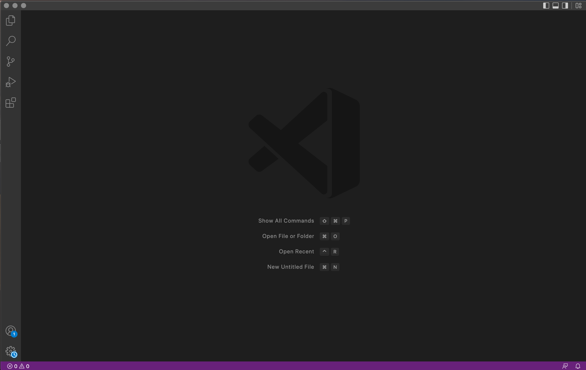
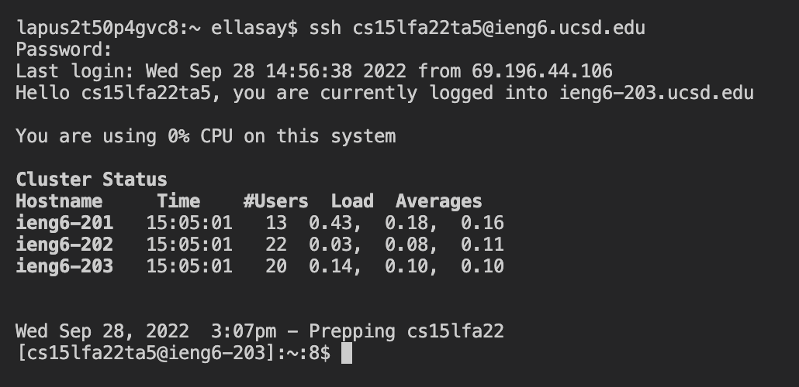
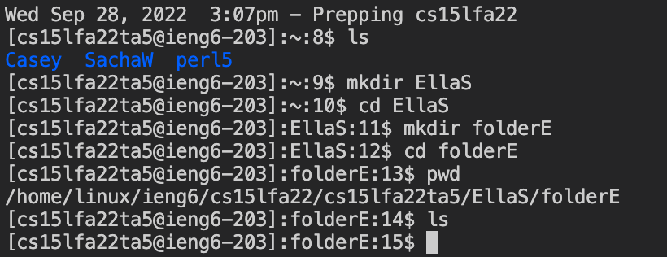
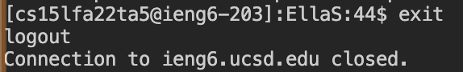
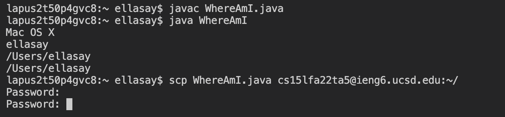
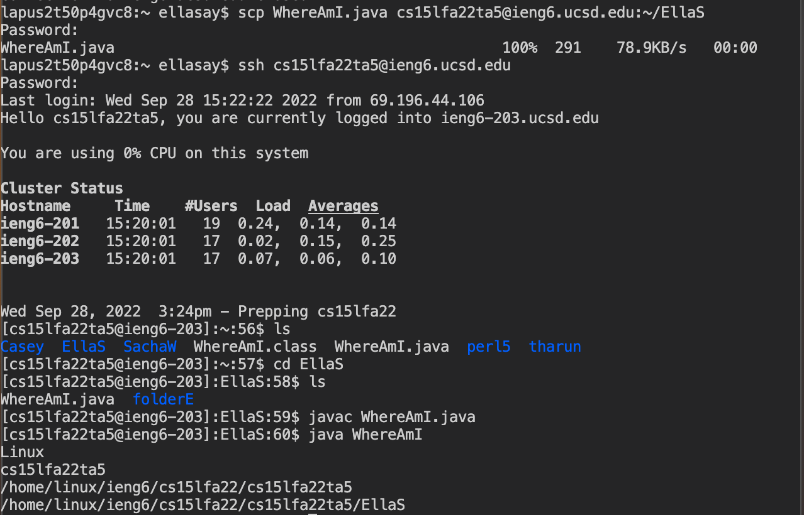
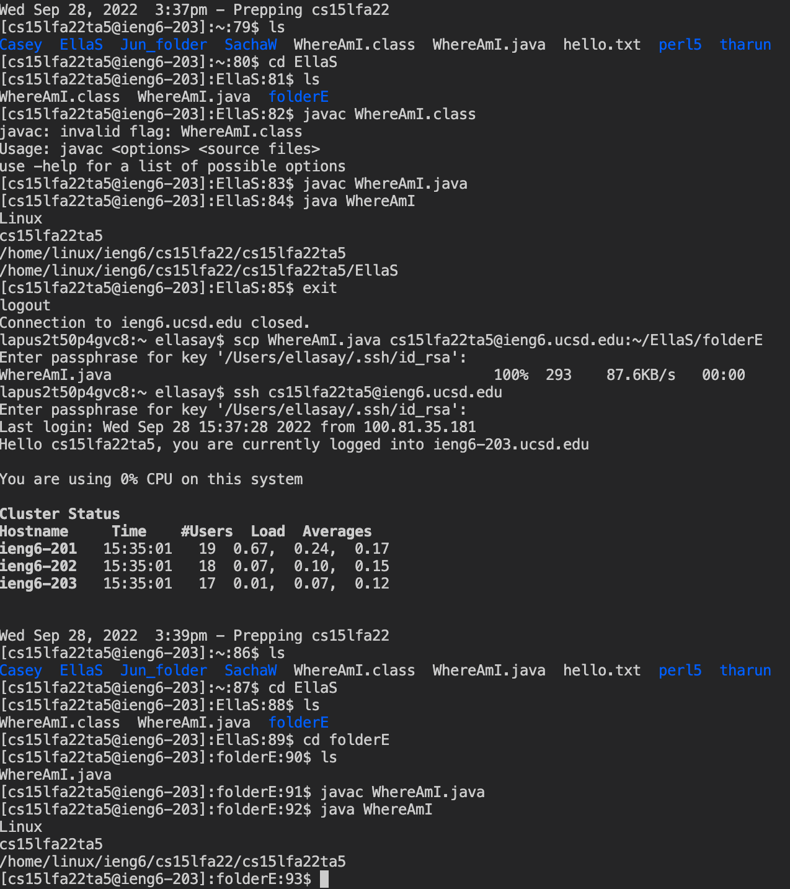

# Lab Report 1: Remote Acess

The following tutorial is how to access a course-specific account remotely on ieng6 using Visual Studio Code

1. **Installing VSCode**

I already had VSCode downloaded onto my personal computer. However, the download process is relatively straightforward, saving the online package and downloading like any other application. 

Once downloaded, the opening page of VSCode should look like this: 



Use the top bar to open a new terminal (also shift, up arrow, apostrophe on Mac). This is where you will be writing your code.

2. **Remotely Connecting**

The following command will be written in your private server:

``` $ ssh cs15lfa22xx@ieng6.ucsd.edu ```

The ssh command stands for "secure shell" and the login is specific to the student (change the 'xx' to your specific login).

This should prompt a few security questions before the logon passcode is required.

``` 
The authenticity of host 'ieng6-202.ucsd.edu (128.54.70.227)' can't be established.
RSA key fingerprint is SHA256:ksruYwhnYH+sySHnHAtLUHngrPEyZTDl/1x99wUQcec.
Are you sure you want to continue connecting (yes/no/[fingerprint])? 
Password: 

```
After entering the password associated with your student account, your page should look like this:



3. **Running ssh commands**

A few commands that can be run in the ssh "secure shell" include:
* cd ~
* cd
* ls -lat
* ls -a
* cp "directory"
* cat

Here is what my code looked like after running a few commands as well as setting up a new folder within my remote server to organize my work.



*I was using a TA account to log in which is why there are more folders than the ones associated with my name - there were multiple students working on the same account to learn these functions.*

4. **Moving files with scp**

scp is a helpful tool to move files from your secure comupter to the remote access server. 

This command requires you to log out of the remote server (opening a new terminal will not work, you must log out entirely). You can do so by entering:

`exit` into your terminal. The output to running exit should look like this:



Now in your personal command line, compile and run a file. I wrote and ran the file WhereAmI.java. You can copy and create your own file from the code below:

``` 
class WhereAmI {
  public static void main(String[] args) {
    System.out.println(System.getProperty("os.name"));
    System.out.println(System.getProperty("user.name"));
    System.out.println(System.getProperty("user.home"));
    System.out.println(System.getProperty("user.dir"));
  }
}
```

To compile and run java from the terminal you need two commands: 
`` javac WhereAmI.java`` will compile your new file and ``java WhereAmI`` will run the new class you just created. In your personal server, this output should look like this:



You can now run the sch command line which will transfer the code to your remote server of choice. The command looks like:

``` 
scp WhereAmI.java cs15lfa22zz@ieng6.ucsd.edu:~/
```

*remember to change the username to your own. the ~/ is a reference to your home directory in your remote account. You can add specific folder names after the / to specify which folder to move the file to*

After running this command line, it will prompt you to enter the same password. You can now log back into the remote server and it should look something like this:



5. **SSH Keys**

ssh keys are a shortcut so that you don't have to type in the tedious passcode each time you log into the remote server. This is the command line and output that you should see after running ssh

```
$ ssh-keygen
Generating public/private rsa key pair.
Enter file in which to save the key (/Users/ellasay/.ssh/id_rsa): /Users/ellasay/.ssh/id_rsa
Enter passphrase: 
Enter same passphrase again: 
Your identification has been saved in /Users/ellasay/.ssh/id_rsa.
Your public key has been saved in /Users/ellasay/.ssh/id_rsa.pub.
The key fingerprint is:
The key's randomart image is:

```

You can now use the empty passphrase to edit the WhereAmI code and sch it back into the remote server much more quickly and easily. 



6. **Shortcuts/Optimizing Remote Running**

Some of the best shortcuts I tried out in the remote server included:

* Using the up arrow to recall previous lines of code (such as the ssh command line so I didn't have to retype the entire username)
* writing a ls/pwd command immediately after the ssh line which would send me directly to that folder instead of having to write out ls to direct myself to the specific folder I wanted
* Using semicolons: this one uses the same amount of keystrokes but is generally faster because you don't have to wait for each command ot load before writing the next line
