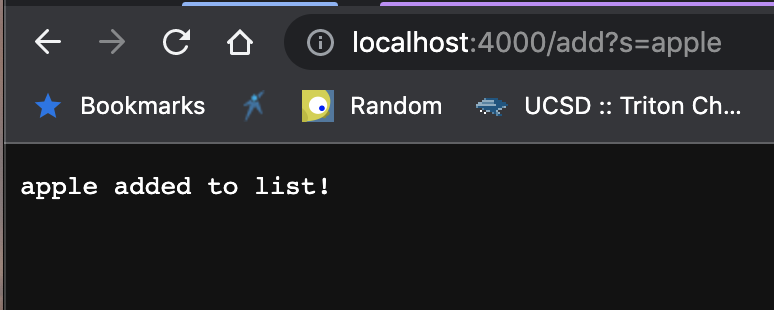
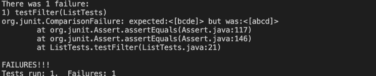

# Lab Report 2: Search Engine and Debugging

# Part 1
## My code for the Simplest Search Engine:

```
class Handler implements URLHandler {
    //Create ArrayList
    ArrayList<String> arr = new ArrayList<String>();

    public String handleRequest(URI url) {
        if (url.getPath().equals("/")) {
            String arrString = String.join(", ",arr);
            return String.format("Items: %s", arrString);
        } /*else if (url.getPath().equals("/increment")) {
            num += 1;
            return String.format("Number incremented!");
        }*/ else {
            System.out.println("Path: " + url.getPath());
            if (url.getPath().contains("/add")) {
                String[] parameters = url.getQuery().split("=");
                if (parameters[0].equals("s")) {
                    arr.add(parameters[1]);
                    return String.format("%s added to list!", parameters[1]);
                }
            }
            if (url.getPath().contains("/search")){
                String[] args = url.getQuery().split("=");
                if(args[0].equals("s")){
                    ArrayList<String> contains = new ArrayList<String>();
                    for (int i=0; i<arr.size();i++){
                        if (arr.get(i).contains(args[1])){
                            contains.add(arr.get(i));
                        }
                }
                String containsString = String.join(", ",contains);
                return containsString;
                }
            }
            return "404 Not Found!";
        }
    }
}
```
## Screenshot 1

* Used handleRequest method to interpret what the URL is saying
* Calls getPath to determine if it is add or search and determines that this URL is calling add
* Then calls getQuery to get what item is being added, in this case the value is "apple"
* The output calls the return line to output the "apple added to list!"

## Screenshot 2

* Uses handleRequest to interpret what the URL is saying
* Looks for the "/" to determine if the path is add/search, determines that the input is search
* Because the input is search, the Query finder is then implemented to find what we are searching for
* the value that we are searching for is "app"
* the output just prints the values in our list that had "app"
* for reference, the list (after adding everything) was: potato, apple, crabapple, app, banana

## Screenshot 3

* Uses handleRequest to read for the path and the query
* finds that the path is search which causes the method to move to find the Query
* The query input here is invalid
* Outputs the error  message "404 Not Found!"

# Part 2
## Debugging reverseInPlace method

The original code for the reverseInPlace method:


The failure inducing test for the reverseInPlace method:


*The reason why this test broke the original code is because the code did not iterate through the entire array. It would get halfway through and then the values that were originally at the beginning would be at the end again. A big issue causing this is that the i value is set to arr.length.*

The failed output for the test:


*The error message here reads that the expected value of 1 was actually 3 which makes sense given the bug because the first and last value will end up in the wrong place.*

The fixed code for reverseInPlace:


*The fix for the code was relatively simple. Instead of arr.length for the "for loop" I set i to limit out at arr.length/2. Then, I created a temporary variable to set the first and last variable as each other and then parse to the center of the array.*

**Symptom:** first and last values of the expected output array were switched

**Bug:** loop parsed through the entire list instead of the first half and then mirroring it


## Debugging the filter method

Filter Test that induced failure:


*This test broke the original code because the way the original code was written, it would add the "s" string to the 0th index of the List instead of adding it to the end of the list*

Filter output:


*The output of this test did the symptoms that we predicted which was that it would return the incorrect order of values in the output list because because the 0th index would be the only one that ever got "added" to. The list would end up being backwards.*

Filter fixed code:


*I fixed the symptom by removing the index attributing part of the result.add line. Instead, I just used the built in add method in order for the "s" string to be added to the end of the list.*

**Symptom:** endless loop

**Bug:** s value was being input into the 0th index instead of the end of the list


