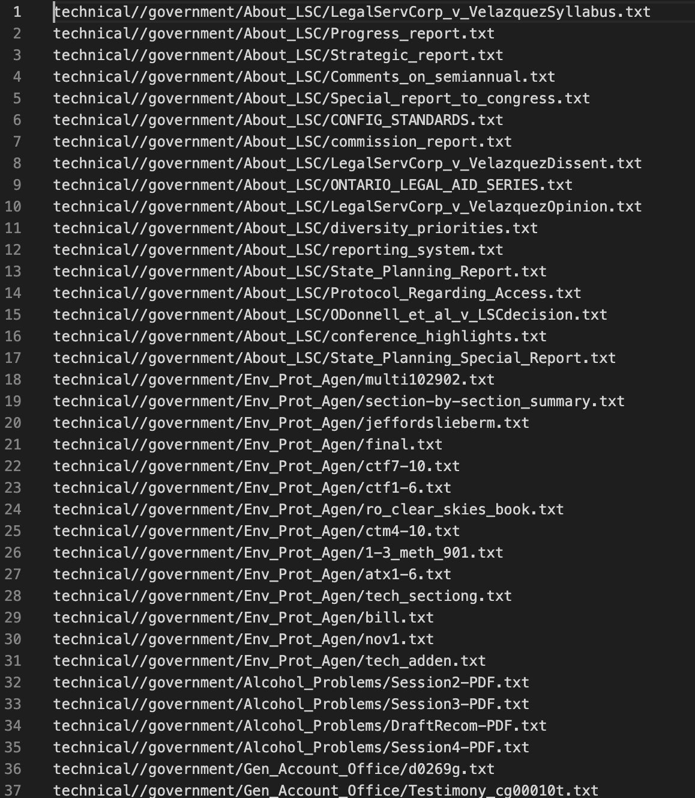
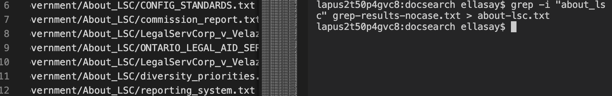
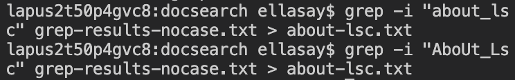
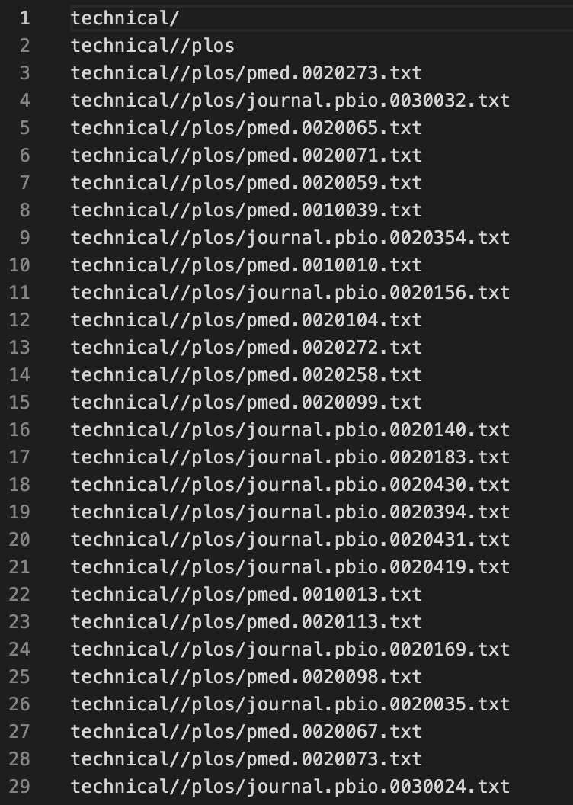

# Lab Report 3: Researching Commands

# The "grep" command

## Command-line option #1: -i --ignore-case

**Input**
```
grep -i ".Txt" find-results.txt > grep-results-nocase.txt
```
**Output** 

*The output created a new file called "grep-results-nocase.txt" that contained all the files with .txt as the extention even though the command line had an error where the T was capitalized.*

**Input**
```
grep -i "about_lsc" grep-results-nocase.txt > about-lsc.txt
```
**Output**

*Here, the files ending in .txt were parsed for containing the string "about_lsc" which has camel-capitalization in the file name but because we used -i it returned all the files that had About_LSC as well.*

**Input**
```
grep -i "AboUt_Lsc" grep-results-nocase.txt > about-lsc.txt
```
**Output**

*This test example was to see what would happen when some of the letters were correctly capitalized and some were incorrect. Clearly, the entire notion of capitalization is cancelled when using -i.*


## Command-line option #2: -v --invert-match
**Input**
```
ellasay$ grep -v ".txt" tech-files.txt > invert-grep.txt
```
**Output**
```
technical/
technical//government
technical//government/About_LSC
technical//government/Env_Prot_Agen
technical//government/Alcohol_Problems
technical//government/Gen_Account_Office
technical//government/Post_Rate_Comm
technical//government/Media
technical//plos
technical//biomed
technical//911report
```
*This example returned all the directories in the technical path because it inverted the search for any files that end in .txt*

**Input**
```
grep -v "/" tech-files.txt > invert-grep2.txt
```

**Output**
*The output file to this command was empty because all of the file lines and directories in tech-files.txt have a "/" in the name.*

**Input**
```
grep -v "government" tech-files.txt > invert-grep3.txt
```
**Output**

*This output contains all the files besides the government path. This grep command is very useful when trying to find "all but" some of the files. Instead of calling grep on multiple things or even things that are unknown, you can just eliminate some of the file types.*


## Command-line option #3: -c --count

**Input**
```
grep -c ".txt" tech-files.txt > count-grep.txt
```
**Output**
```
1391
```
*This test counted the number of files ending in .txt in the technical/ directory. This is an alternative to searching for wc.*

**Input**
```
$ grep -c "government" "plos" tech-files.txt > count-grep.txt
```
**Output**
```
grep: plos: No such file or directory
```
*This  output was a result of testing whether or not you should search for multiple strings within a file.*

**Input**
```
$ grep -c "government" tech-files.txt invert-grep.txt  > count-grep.txt
```
**Output**
```
tech-files.txt:292
invert-grep.txt:7
```
*After testing to see if I could search for multiple strings within a file, I learned that I could search for the same string within multiple files and the output would be a colon list with the file name and the count within that file.*


