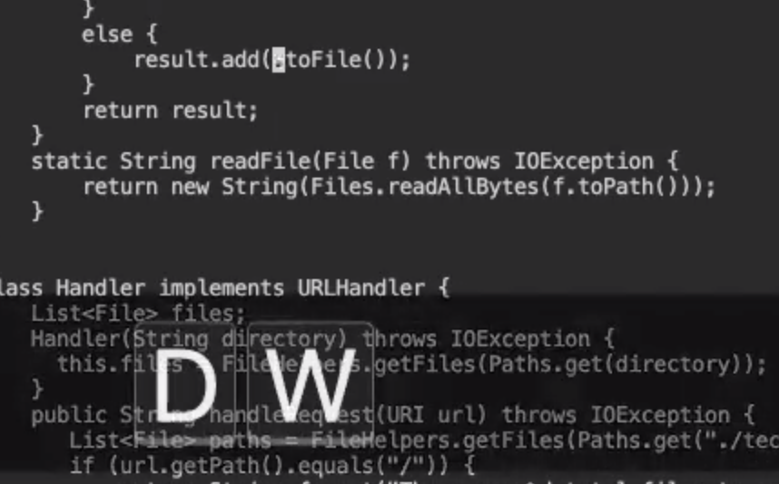

# Lab Report 4: vim

# Part 1

## Changing the name of the start parameter and its uses to base

`` /start <enter> dw base <esc> i base <esc> n dw i base <esc> n dw i base :wq <enter> ``

*Using the /search command to find 'start'*

*Using dw to delete an entire word*

*Enter insert mode and type out 'base'*

*Escape to normal mode and use next for next instance of 'start'*

*Repeat 2 more times and then save and exit using :wq*

# Part 2

