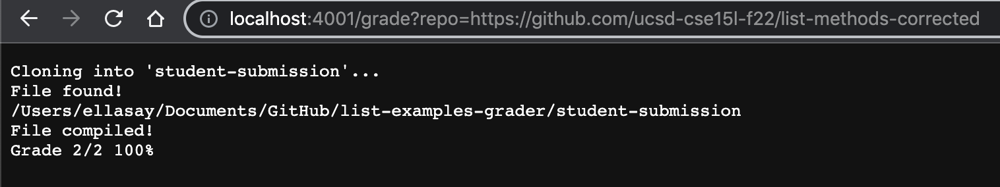
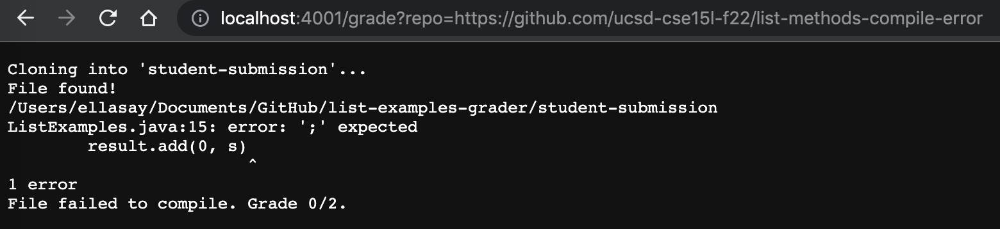
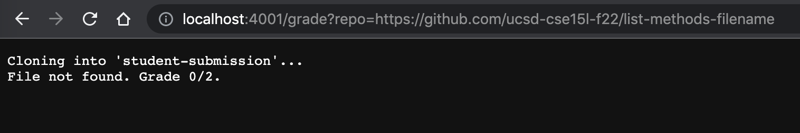

# Lab Report 5: Grade Script

# My code


```
# Create your grading script here

#set -e

rm -rf student-submission
git clone $1 student-submission

cp TestListExamples.java student-submission
cp -r lib student-submission
cd student-submission

if [ -e ListExamples.java ]
then
    echo "File found!"
else
    echo "File not found. Grade 0/2."
    exit 1
fi

pwd
javac -cp .:lib/hamcrest-core-1.3.jar:lib/junit-4.13.2.jar *.java
if [ $? -eq 1 ]
then
    echo "File failed to compile. Grade 0/2."
  
    exit 1
else 
    echo "File compiled!"
fi

java -cp .:lib/hamcrest-core-1.3.jar:lib/junit-4.13.2.jar org.junit.runner.JUnitCore TestListExamples 2> error.txt > out.txt
if [ $? -eq 0 ]
then
    echo "Grade 2/2 100%"
    exit
else
    grep -c "error:" error.txt > result.txt
    cat result.txt
    echo "Failing some tests."
    exit
fi
exit

```
# Screenshots of server

## Corrected List Methods



## Compile Error



## File Not Found



# Script trace of Compile Error

- Line 5-10 commands

    * Standard Output: Directories and paths changed to be in the correct student-submission directory
    * Standard error: would be 0 if failed to change 

 - Line 12

    * Condition was true which caused the lines 13 and 14 to run but skipps lines 15-17

- Line 13 and 14

    * Standard output: echoed command found
    * Standard error: 0

- Lines 15-17

    * Not run due to line 12 being true

- Line 20

    * Standard output: printed working directory 
    * Standard error 0

- Line 21

    * Standard output: compiles the junit and the file given
    * Standard error 1

- Line 22

    * This line was false due to the standard error being 1 from the previous command
    * The file was not able to compile

- Lines 23-26

    * Skipped because line 22 was false

- Line 27-29

    * Standard output: File failed to compile
    * Standard error 1 
    * Code is exited

- Lines 30-42

    * Not accessed due to the failure to compile in the second if statement block


